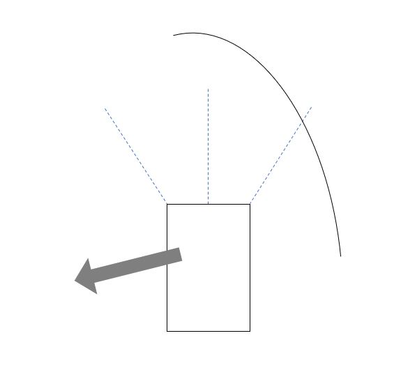
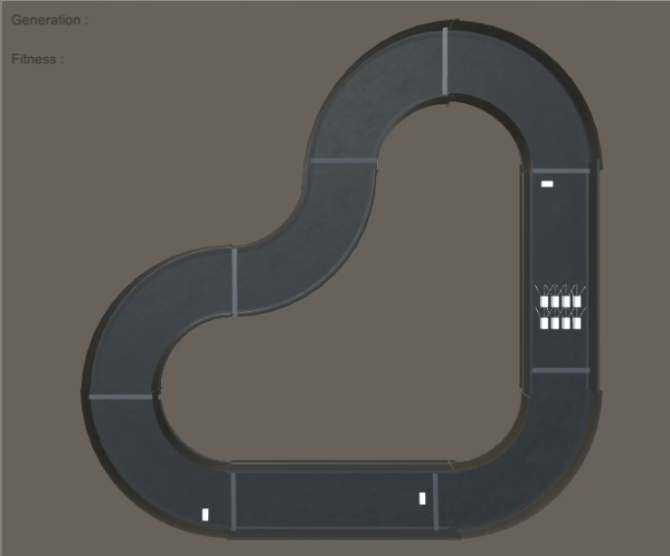

## 유전 알고리즘 
### Introduction

   - Teachable machine을 사용해보고, 유튜브로 머신 러닝 영상들을 찾아보다가, 유전 알고리즘으로 자동차 자율 주행을 위한 최적의 조건을 찾는 영상이나 그네를 타기 위해 학습시키는 영상을 보게 되었고, 재밌어보여서 공부하게 되었다. 

   - 유전 알고리즘을 공부하고, 간단하게 자율 주행 자동차를 위한 최적의 조건을 찾아보았다.

### Generic Algorithm

   - 사건 안에서 더 나은 결과를 갖는 염색체들끼리의 유전 정보 교차하여 세대를 거듭하면, 점점 더 나은 염색체를 얻을 수 있겠다는 생각에서 시작. 

   - Chromosome : 염색체, Gene : 유전자, Child : 자손, Fitness : 적합도

### Process 

   - 유전 알고리즘을 구현하기 위한 순서는 다음과 같았다.

   1. Definite : 학습하고자 하는 정보를 어떤식으로 표현할 것인가.

   2. Fitness : 어떤 기준으로 유전자의 우수함을 정의할 것인가.

   3. Selection : 교배될 염색체를 어떤 기준으로 선정할 것인가.

   4. Crossover : 유전 정보를 어떻게 교차할 것인가.

   5. Mutate : 돌연변이 염색체를 어떤 방식으로 출현 시킬 것인가.

### 1. Definition

   - 염색체와 유전자 정보를 정의한다.

   - 유전자 정보는 염색체가 생존에 영향을 미치는 요인, 학습에 결과를 달리할 요인으로 정의한다. 

### 2. Fitness

   - 생존 결과를 점수화한다. 비행기를 학습시킨다면, 주행 거리나 비행 시간처럼 결과를 점수화하여 우수한 생존을 구분한다.

### 3. Selection

   - 다음 세대에 전달될, 즉 교배에 성공할 염색체를 적합도를 기준으로 선별한다.

   - 대표적으로 적합도에 따라 선택 비중을 달리하여 랜덤하게 추출하는 방식(Roulette wheel), 순위따라 직접 정한 확률을 기준으로 선택 비중을 달리하는 방식, 최고점의 염색체는 반드시 추출하는 방식 등이 있다.

### 4. Crossover

   - 선별에서 선택된 염색체들의 유전 정보를 섞어 다음 세대 염색체의 유전자를 구성한다.

   - 대표적으로는 긴 비트열에 하나 또는 다중의 point를 두고 그것을 기준으로 나눠 다른 염색체와 교차하는 point crossover 방식과 두 유전값 자체를 평균화하는 uniform crossover 방식이 있다.

### 5. Mutate

   - 중세 유럽의 근친 결혼이 낳은 유전병처럼, 아무리 좋은 유전자를 갖는 집안이라도 같은 부모의 염색체끼리만 교배해서는 최적의 자손을 기대할 수 없다. 따라서 작은 확률로 돌연변이를 만들어 준다.


   - 대표적으로 비트를 반대로 하는 reverse 방식, 두 비트를 서로 교환하는 exchange 방식, 또는 아예 새로운 랜덤한 값을 갖게하는 방식 등으로 돌연변이를 산출한다.    
   
## Generic Algorithm / AI car

자율 주행 구현

   - 아래와 같은 프로세스로 주행 자동자 학습을 진행하였다. 그냥 GA를 잘 이해하고 있는지 확인하기 위한 구현이라 크게 모양이나 성능에는 신경을 쓰지 않았다. 

   - 환경은 유니티, 코드는 C#을 사용하였다.

### 1) Definition

   - 각 자동차는 좌우 대각선 센서와 정면 센서를 갖고 있다. 굽은 길에서 센서가 어떻게 접하는지에 따라 적당한 회전값을 주면 부딪히지 않고 나아갈 것이다. 자동차의 출발 위치로 16군데가 가능하다. 자동차는 fence에 부딪히지 않고 완주, 그 이후에는 더 빠르게 전진하는 것을 목표로 한다. 즉 최종 목표는 최적의 출발 시점과 센서 감지별 최전의 회전량을 구하는 것이다.
   
   

오른쪽 센서에 장애물이 검출 됐을 때, 왼쪽으로 회전시킬 힘을 구해야한다.

   - 염색체는 자동차로 하고, 유전 정보는 다음과 같이 24비트로 구성하였다. 

  

각각 숫자는 비트 수를 표시  

   - x,y는 16개의 다른 시작 위치를 표현하기 위하여 필요한 2비트 씩을 나타낸다. Sides, Side & Forward, Forward는 각각의 위치에서 장애물이 검출됐을때 회전량을 표현한다.

### 2) Fitness

   - 적합도는 완주 전에는 거리에 비례, 완주 후에는 걸린 시간에 반비례해야한다. 

   - 트랙을 여러 구간으로 나누어 점수(코드 : record)를 매기고, 완주가 확인되면 이 점수 값에 "임의의 상수 - 걸린 시간"을 더하는 것으로 적합도를 측정하였다. 이것으로 완주 전에는 거리에 비례하면서, 완주 후에는 완주를 못 끝낸 상황에 비해 더 좋은 적합도를 갖으면서도 시간에 반비례한 스코어를 얻을 수 있다.

``` c#
void CalculateFitness() { 
   for (int i = 0; i < geneCount; i++) { 
       fitness[i] = cars[i].record; } 
}
```

### 3) Selection 

   - 룰렛 휠 방식을 사용해서 적합도별로 가중치를 두어 더 적합한 염색체가 그만큼 더 많이 교배될 수 있도록 하였다.

   - 적합도를 모두 더하고 각 적합도로 이를 나누는 것으로 각 염색체가 얻을 가중치를 백분위로 구하였다.
``` c#
void Selection(){ 
   for(int i=0; i<geneCount; i++){ 
      int rand_roulette = Random.Range(0, 100); 
      selected[i] = RouletteWheelTable(rand_roulette);
      } 
    } 

int RouletteWheelTable(int rand){ 
   float fitness_sum = 0; 

   foreach (float f in fitness) {
      fitness_sum += f; 
   } 

   for (int i=0; i<geneCount; i++) 
   { 
     float PR = (fitness[i] / fitness_sum) * 100; 

        if (PR<= rand)
           rand -= (int)PR; 
        else
           return i; 
        } 
   return -1; 
 }
```
### 4) Crossover

   - 선택된 염색체들을 2개씩 짝지어 교배하여 새로운 염색체 하나를 만든다. 즉 선택된 염색체에서 2개를 뽑아 유전자를 섞어 자식 염색체를 만드는 것을 부모 염색체 개수 만큼 반복한다.

   - 유전자는 x, y, Sides, Sides&Forward, Forward 다섯 영역으로 나눠져 있다. 하나의 염색체는 x, Sides, Forward's 2bit, 나머지 다른 하나의 염색체는 y, Sides&Forward, Forward's left 2 bit를 결정하도록 하였다.

   - 선택된 염색체들 중 임의의 두 개체는 교배없이 그 자체로 자식이 된다. 이후 선택된 염색체들 중 임의로 짝지어진 두개의 염색체를 교배한 값으로 하여 자식이된다.
``` c#
void CrossOver() 
{ 
     int rand_selectedIndex1; 
     int rand_selectedIndex2; 

     rand_selectedIndex1 = Random.Range(0, geneCount); 
     rand_selectedIndex2 = Random.Range(0, geneCount); 

     childCarsValue[0] = cars[selected[rand_selectedIndex1]].value;  
     childCarsValue[1] = cars[selected[rand_selectedIndex2]].value;   
         
     for (int i = 2; i < geneCount; i++) 
     { 
         rand_selectedIndex1 = Random.Range(0, geneCount); 
         rand_selectedIndex2 = Random.Range(0, geneCount); 

         int cv = (cars[selected[rand_selectedIndex1]].value & 0xCF0F0C) 
               + (cars[selected[rand_selectedIndex2]].value & 0x30F0F3); 

         childCarsValue[i] = cv; 
     } 
 }
```
### 5) Mutate

   - 지정된 확률에 따라, 자식 유전자를 아예 랜덤한 유전자를 갖게 하였다.
``` c#
 void Mutate(float mutatePR) 
 { 
     for(int i=0; i<geneCount; i++) 
     { 
         float mutateRand = Random.Range(0, 100); 

         if (mutatePR < mutateRand)  { 
             childCarsValue[i] = Random.Range(0, 0xFFFFFF+1); 
         } 
     } 
}
 ```
### Note / Result

   - 학습은 잘된다. 처음에는 센서에 벽면이 검출되면, 랜덤하게 회전하여 나아가지도 못했던 자동차들이 완주에 성공하고, 그 이후로는 더 빠르게 완주할 수 있는 자동차가 우수한 염색체로 선택되어 점점 빠른 주행이 가능하도록 발전한다. 돌연변이가 없는 한 모든 자동차가 결국 하나의 염색체로 통일된다. 

  

각자 센서별 다른 회전값을 갖고 주행 후 더 빠른 염색체가 우수한 개체로 선택된다.  
   - 학습이 잘 진행되고 있는지 확인하기 위해 염색체의 적합도, 선택된 염색체, 교배 상황, 부모 염색체와 자식 염색체를 기록하였다.

  

Test Img : selectedData, crossoverData, geneData  (geneData에 6번 자식 유전자는 돌연변이로, 출력 오류)
   - selectedData에서, 적합도가 높은 8,6이 비교적 많이 선별되었고 낮은 확률로 0이 선택되었다. CrossoverData에서는 그 선별된 염색체 중에 임의의 2개(2,8)에 해당하는 염색체는 그대로 다음 자식이 되고, 이후에는 2개씩 짝 지어져 유전자가 조합되고 자식 유전자를 형성하는 것을 볼 수 있다. GeneData는 부모 유전자와 다음 자식 유전자를 보여준다.   

Obstacle 추가
- Map에 장애물을 넣어보았다. 첫번째 장애물은 부드럽게 넘어가도, 두번째 장애물은 감지 시 오히려 오른쪽으로 부드럽게 꺾어 벽에 충돌하고, SharpTurn을 이용해서 왼쪽으로 틀어 지나는 등 생각했던 것과 다른 다양한 방식으로 장애물을 피해가는 것으로 학습되었다.

  

빨간색이 1순위, 파란색이 2순위, 노란색이 돌연변이 염색체이다.
